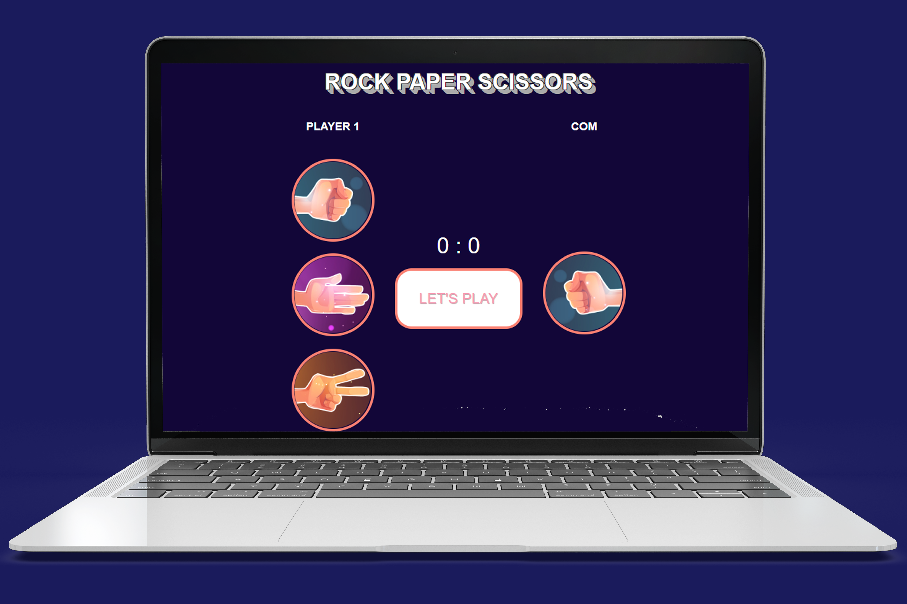
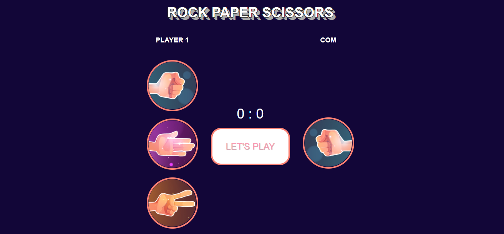
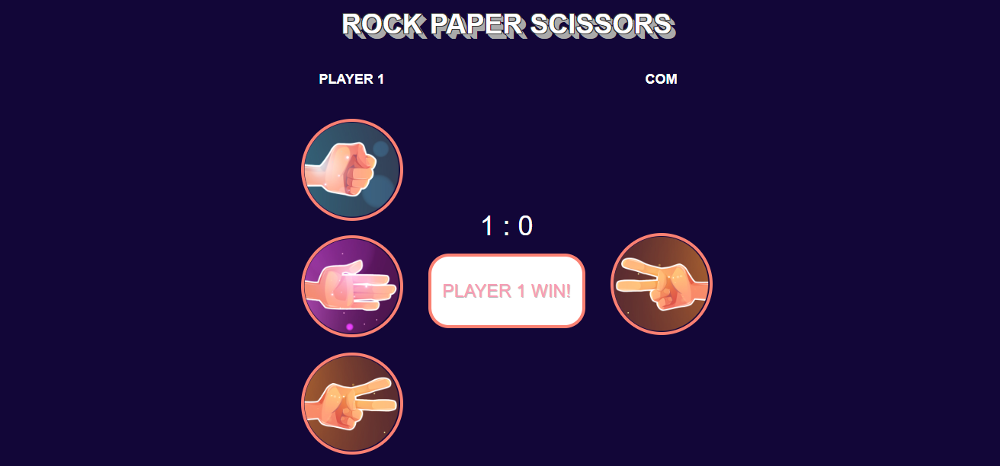
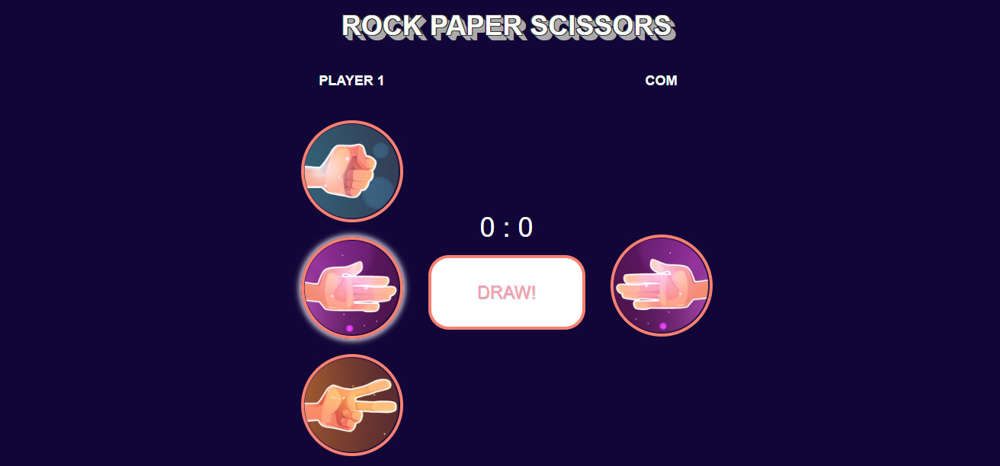
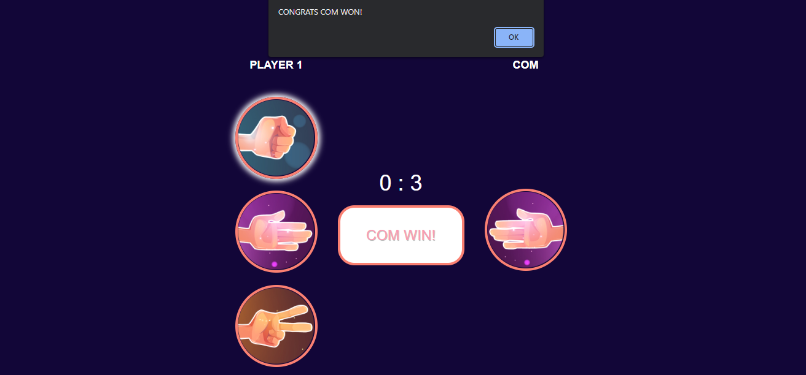

# Overview

The game "suit" / rock paper scissors with Javascript DOM that implementation about DOM Selection, Manipulation Element & Node, and Event.

### Features

- Rock Paper Scissors as Player
- Score between Player and Com
- Alert to Tell Who Win The Game

### Screenshot

## My Process

### Built with

- HTML5
- CSS3
- JavaScript DOM

## Author

- muhamadjaya